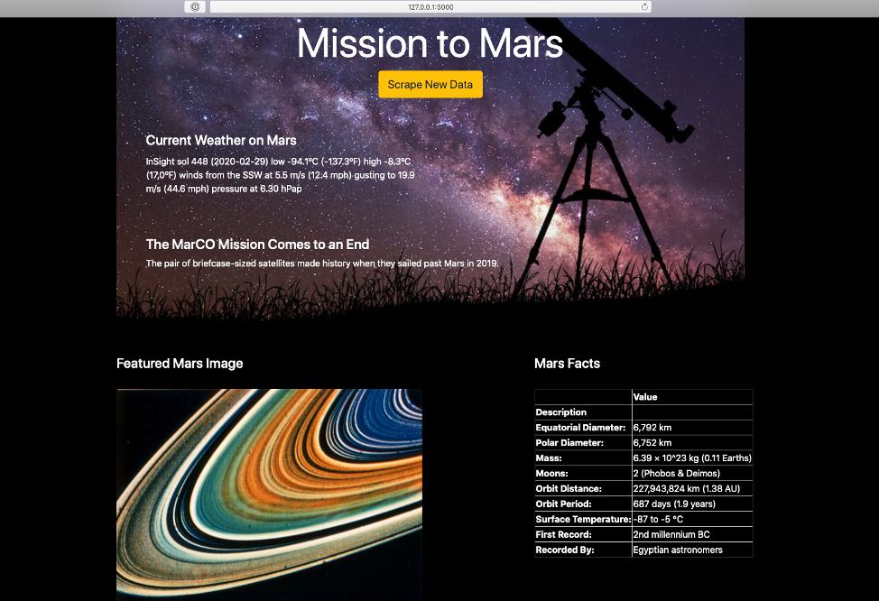
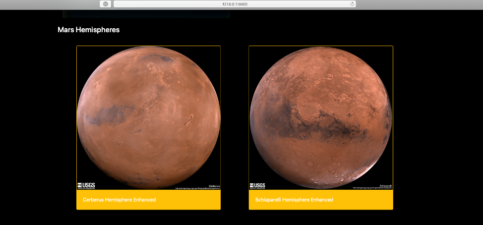
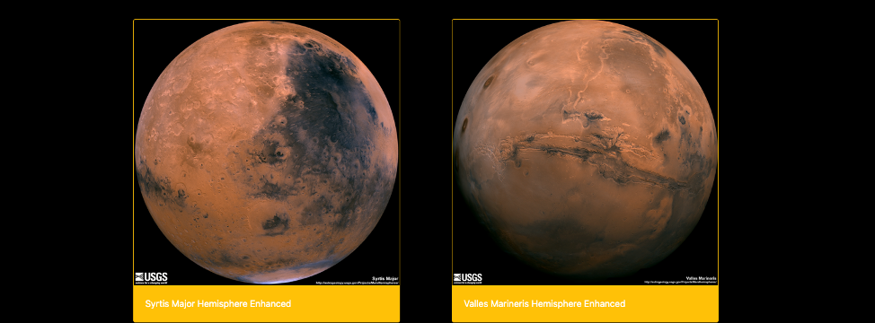

# Mars Facts Web Application

This project used Jupyter Lab to create and test the web scraping code and then converts it into a Flask web application. 
The application stores a dictionary in a Mongo database containing the scrapping data and creates a page from an Bootstrap HTML template to display all the data.
The app.py file is the Flask single page application that allows the user to view all the scraped data. Once the page is opened, the user can click the button "Scrape New Data" to receive current weather in Mars, atest Mars related from NASA's Twitter page, featured Mars image and a table with Mars facts and images from its hemispheres.

#### 1 - Scrape various websites:

 * Python:
      * requests.get(), 
      * Beautiful Soup, 
      * Pandas (pd.read_html) 
      
  * Selenium WebDriver 
      * chromedriver,
      * geckodriver
      
 #### 2 - Store and manipulate scraped data: 
 
  * Python:
      * Pymongo
      
  * MongoDB (non-relational database)
  
 #### 3 - App
 
  * Flask Application
  * HTML
  * Bootstrap

